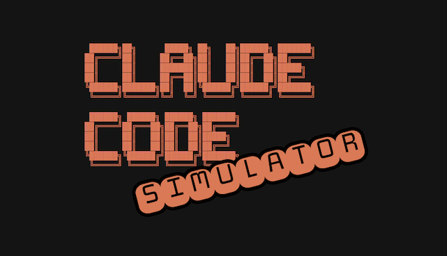

# AutoClaude — Claude Code Simulator



An endless, self-running mockup of a Claude Code terminal session. A single
self-contained `index.html` with no dependencies — open it in a browser and it
continuously simulates Claude Code working on a front-end project: planning
todos, exploring files, editing HTML/CSS/JS with inline diffs, running tests,
builds, and commits, forever.

**[Live demo →](https://crnds.github.io/autoclaude)**

---

## Features

- Realistic Claude Code terminal UI with spinner, progress bars, and diff output
- Tasks cycle through explore → implement → verify → commit phases
- Large code scenarios: 40–100 line additions, replacements, and removals
- Interactive input mode — click the prompt bar, type anything, press Enter to mock a response
- Speed control, pause/resume, and font size adjustment
- Suspends automatically when the tab is hidden to save CPU

## Usage

Open `index.html` directly in a browser. No server, build step, or network
access required.

```bash
open index.html
```

## Controls

| Key / Action | Effect |
|---|---|
| ↑ / ↓ | Increase / decrease animation speed |
| Enter | Pause / resume the session |
| + / − | Increase / decrease font size |
| Click prompt bar | Enter input mode — type a fake command |
| Esc | Cancel input mode |
| Enter (input mode) | Submit command → mock 10–15s response → resume |
| Click outside prompt | Exit input mode (keeps typed text) |
